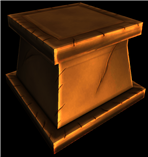
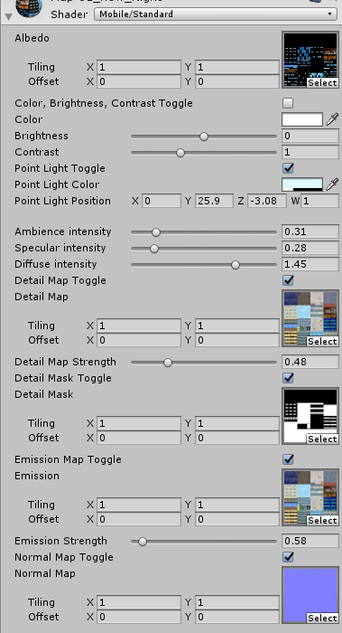

# Standard Shader (Mobile)
A shader written in Unity's ShaderLab and CG, designed for mobile devices. See [usage](USAGE.md)

  
*No external lighting has been passed in to create the lighting effect on this block*

This shader is kept fast by disabling shader features that are not being used during compilation
## Features
 * Supports lightmaps and exponential2 fog
 * Can adjust color tint, brightness and contrast
 * Specify a single point light for diffuse, specular and normal mapping effects
 * Can modify the location of the point light via script (eg. a sun moving across the sky)
 * Adjust point light's Blinn-Phong intensity (ambience, specular and diffuse)
 * Add a detail map, adjust strength and add a detail mask
 * Add an emission map, adjust strength
 * Add a normal map  

   

## Important Notes
 * Doesn't support shadow casting
 * No other lighting (except lightmaps) are passed in. If you need more lighting options, consider using a different shader.
